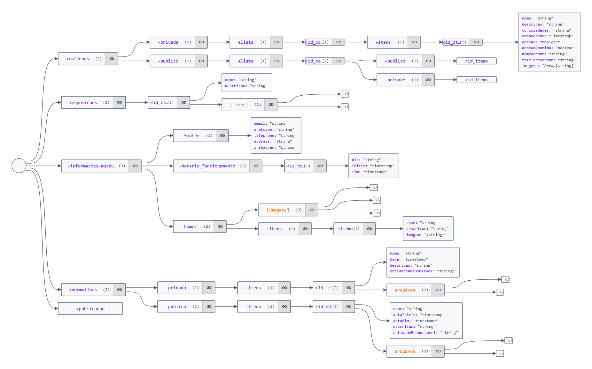

# Website para o Museu Jacinto de Sousa em Quixadá-CE

Essa organização contém os projetos realizados para o website do Museu Jacinto de Sousa, desenvolvidos durante a disciplina de Projeto Integrado em Engenharia de Software II na UFC - Campus Quixadá.

## Equipe

- Erick Gabriel Ferreira Gaspar - [@erickgabrielfg](https://github.com/erickgabrielfg)
- Francisco Paulino Arruda Filho - [@Francisco-Paulino-Arruda-Filho](https://github.com/Francisco-Paulino-Arruda-Filho)
- João Pedro Pereira Holanda - [@Joao-Pedro-P-Holanda](https://github.com/Joao-Pedro-P-Holanda)
- Antonio Kaio Elias Portela - [@kaiop00](https://github.com/kaiop00)
- Pedro Emanuel Santana - [@Pedro-Emanuel](https://github.com/Pedro-Emanuel)

## Processo de desenvolvimento

O processo de desenvolvimento consiste em reuniões semanais para a divisão de tarefas e o uso de dois quadros kanban, um na plataforma Notion é utilizado para tarefas relacionadas à documentação e design, o outro foi criado com o github projects e está vinculado à organização, é utilizado para as tarefas de implementação no front-end e back-end.

- **[Link do quadro no Notion:](https://projetointegrado-museujacintodesousa.notion.site/e2f85625b54a4df7bfa7038f71194e4c?v=a0c160cc691c428193d72dfabd65f8da&pvs=4)**
- **[Link do projects:](https://github.com/orgs/PI-II-Museu-Historico-Jacinto-de-Sousa/projects/1)**

## Prototipação

- **[Link para o protótipo no Figma](https://www.figma.com/file/jQJ9GAFcbHVt4MlO7ckq07/Website-Museu-Jacinto-de-Sousa?type=design&node-id=0%3A1&mode=design&t=6snq9JfVKXawsqf8-1)**

## Documentação

A documentação, incluindo ATAs de reuniões e documento de requisitos está incluindo também no notion

- **[Link das ATAs de Reuniões](https://projetointegrado-museujacintodesousa.notion.site/7727b106024c4e7ebd7441bde1cf1842?v=d940404a49e34e888bff05852af9ef46&pvs=4)**
- **[Link dos outros documentos, incluindo diagramas e modelos de arquivo](https://projetointegrado-museujacintodesousa.notion.site/0b4d965b49824cc7a1fd11b8f978f920?v=985e4eb695ef41b080bb70e4ec505af8&pvs=4)**

### Esquema de Banco de Dados

O esquema do banco de dados é estruturado em um formato JSON, visto que o armazenamento das informações é realizado no Firestore da Google.

- **[Link para visualização no Notion](https://projetointegrado-museujacintodesousa.notion.site/Esquema-do-Banco-de-Dados-18ba9acabdee4bdfbacc58f99fd221f3)**

> ”+” : representa uma coleção do Firestore

>”-”  : representa um documento do Firestore

> ”[]” : elementos dentro de colchetes são arrays

> ”<>” elementos dentro de sinais maior que e menor que são ids ou caminhos absolutos para o Firestore/Storage



```json
{
  "+colecoes": {
   "-privada": {
    "+lista": {
      "<id_colecao>": {
        "+itens": {
          "<id_item>": {
            "nome": "string",
            "descricao": "string",
            "curiosidades": "string",
            "dataDoacao": "Timestamp",
            "doacao": "boolean",
            "doacaoAnonima": "boolean",
            "nomeDoador": "string",
            "telefoneDoador": "string",
            "imagens": "Array[string]"
          }
        }
      }
    }
   },
   "-publico": {
    "+lista": {
      "<id_colecao>": {
        "-publico": {
          "<id_item>": {}
        },
        "-privado": {
          "<id_item>": {}
        }
      }
    }
   }   
  },
  "+exposicoes": {
    "-<id_exposicao>": {
      "nome": "string",
      "descricao": "string",
      "[itens]": [
        "<caminho_item_1>",
        "<caminho_item_2>"
      ]
    }
  },
  "+informacoes-museu": {
    "-footer": {
      "email": "string",
      "whatsapp": "string",
      "telephone": "string",
      "address": "string",
      "instagram": "string"
    },
    "-horario_funcionamento": {
      "-<id_horario>": {
        "dia": "string",
        "inicio": "timestamp",
        "fim": "timestamp"
      }
    },
    "-home:": {
      "[imagens]": [
        "</caminho1>",
        "</caminho2>",
        "</caminho3>"
      ],
      "+itens": {
        "-<item>": {
          "nome": "string",
          "descricao": "string",
          "imagem": "<string>"
        }
      }
    }
  },
  "+normativas": {
    "-privado": {
      "+itens": {
        "-<id_lei>": {
          "nome": "string",
          "data": "timestamp",
          "descricao": "string",
          "entidadeResponsavel": "string",
          "arquivos": [
            "</caminho1>",
            "</caminho2>"
          ]
        }
      }
    },
    "-publico": {
      "+itens": {
        "-<id_edital>": {
          "nome": "string",
          "dataInicio": "timestamp",
          "dataFim": "timestamp",
          "descricao": "string",
          "entidadeResponsavel": "string",
          "arquivos": [
            "</caminho1>",
            "</caminho2>"
          ]
        }
      }
    }
  },
  "+publicacao": {}
}
```
